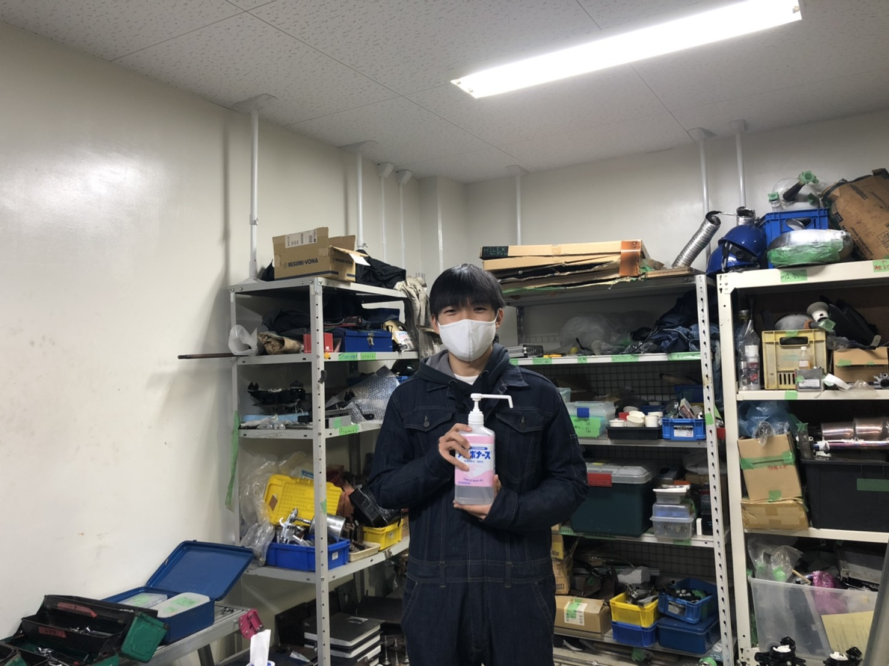

　こんにちは．リアバルクヘッド担当の齋藤です．いつも弊チームのブログをご覧頂きありがとうございます．最近の活動報告をさせて頂きます．

　現在，思うように活動が出来ないなかではありますが，部室の換気、部室への入退室時の体温の測定，こまめな手の消毒などの感染症対策を十分にとりながら，出来る限りの範囲で活動を行っています．

　しかし，オンラインの活動時にはできなかったマシンに触れながらの作業ができることの喜び，学内活動が出来ることの有り難さを日々感じております．近頃，再び感染の拡大がみられますが，チーム全員体調管理，感染症対策を徹底し，今後も活動を続けられるよう心がけていきます．

　これからも長期計画の達成にむけてチーム一丸となって尽力して参りますので，ご支援・ご声援のほど何卒よろしくお願い致します．

Text ：Akari Saito