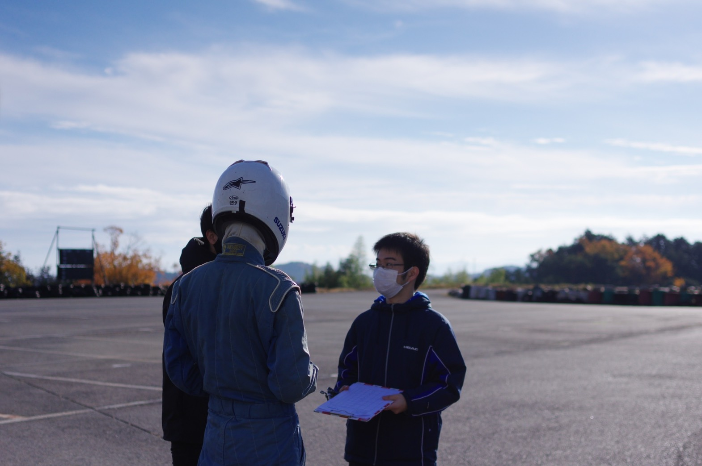

こんにちは，Aero班2回生の久保舜哉です．

12月10日にスポンサードして頂いている琵琶湖スポーツランド様にて走行会を行いました．

今回の走行会では，12月12日に行われたエコパ試走会に向けてのドライバー練習，車検チェック，車両の動作確認を目的とし走行を行いました．

走行内容としては，駐車場スペースでのスキッドパッド練習とサーキットでのスラローム練習，シフト操作練習を行いました．

私自身も駐車場スペースとサーキットにて走行を行い，前後左右の加速度の大きさに驚かされ，そして走行する難しさを痛感しました．と同時に，走行する楽しさも感じ，自分自身のドライビングスキルを大きく向上させることが出来るよう努力して参ります．

また，車両に関しては一分一秒が重要な走行会において全体を通して大きな故障なく走り切れたことを非常に嬉しく思います．

設計期間も中頃を過ぎ，大詰めを迎えております．日々の努力を怠らず確かな進化を成していこうと思います．

Text : Syunya Kubo