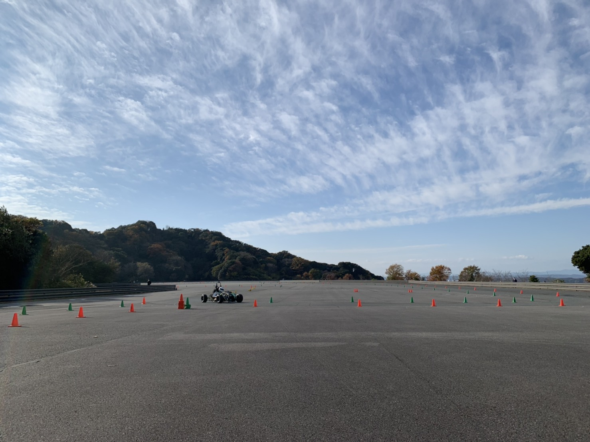

こんにちは，一回生サスペンション担当の原です．

12/12に大会開催地である，エコパスタジアムにて行われた走行会に参加しました．

2020年度大会が中止になったこともあり，他大学のマシンを実際に見るのは初めてだったので，非常に良い経験になりました．

早朝に雨が降ったため路面が多少濡れていましたが，すぐに天気は回復し，ドライタイヤでの走行も出来ました．

また，午前中に起こったマシントラブルの影響で時間が少し削られてしまいましたが，全体としては他校よりも走行時間を確保することができ，有意義な走行会となりました．今回浮き彫りになった課題を見直し，今後の活動に活かしていきたいと思います．

Text : Ryoka Hara