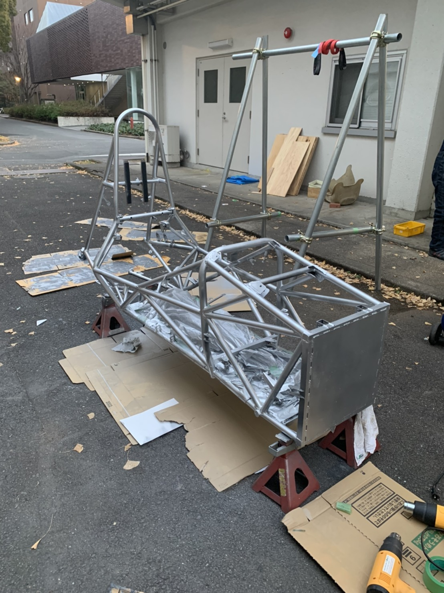

こんにちは．吸気を担当しています，1回生の山﨑と申します．

先日2021年度車両であるGDF-16のフレーム・アームの塗装を行いました．
サビ取りを行い，フレームを綺麗にしました．そして，フレームはシルバー，アームは艶消しブラックに塗装しました．

私自身がパワトレ班ということもあり，フレームについての知識が乏しいところがありましたが，シャシ班の方と作業を進めていく中で様々なことを教えていただき，とても勉強になりました．

新年になり，フレームも綺麗に塗装したことで気持ちも新たに，大会に向けて日々精進してまいります．

Text : Fuma Yamazaki