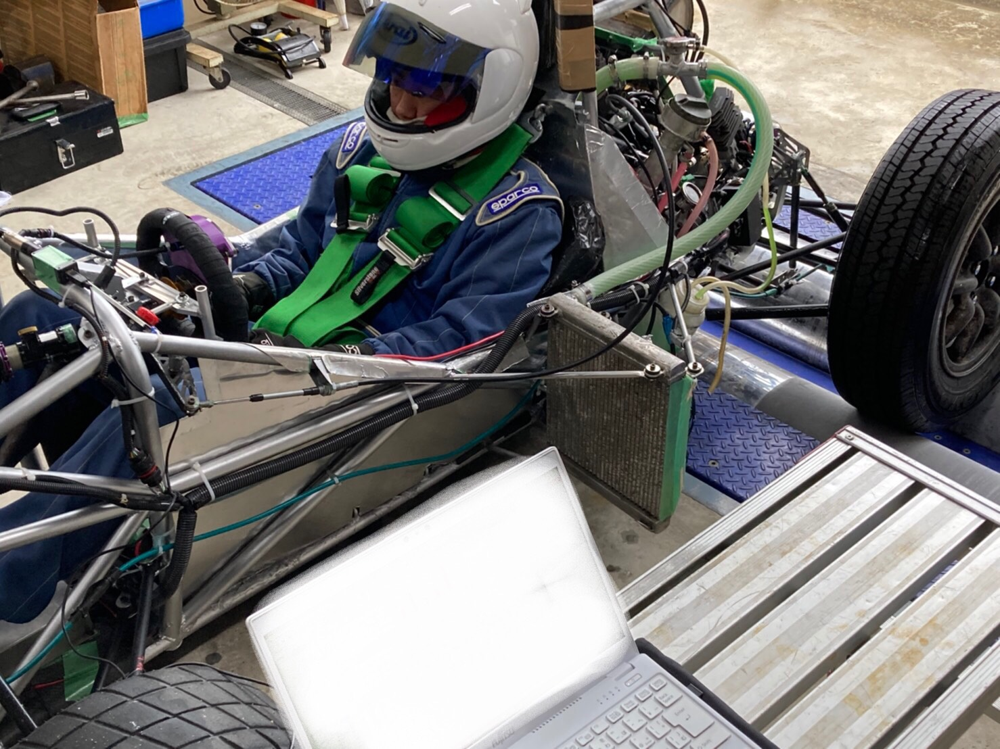

こんにちは．吸気を担当しています，一回生の山﨑です．

一月下旬にシャシーダイナモメーター（シャシダイ）に行きました．

マップ適合，トルクの計測，問題の洗い出しを行いました．コロナの影響で十分にエンジンを回せていない分，様々な問題が浮かび上がりました．

先輩方の車両に向き合う頼もしい姿を見て，学ぶ事がたくさんありました．また，担当パーツについても勉強になる良い機会となりました．

このような経験を積み重ね，チームに貢献できるように努力してまいります．
今回のシャシダイナモで浮かび上がった問題を踏まえ，大会に向けてチームが一丸となって尽力いたします．

Text: Fuma Yamazaki