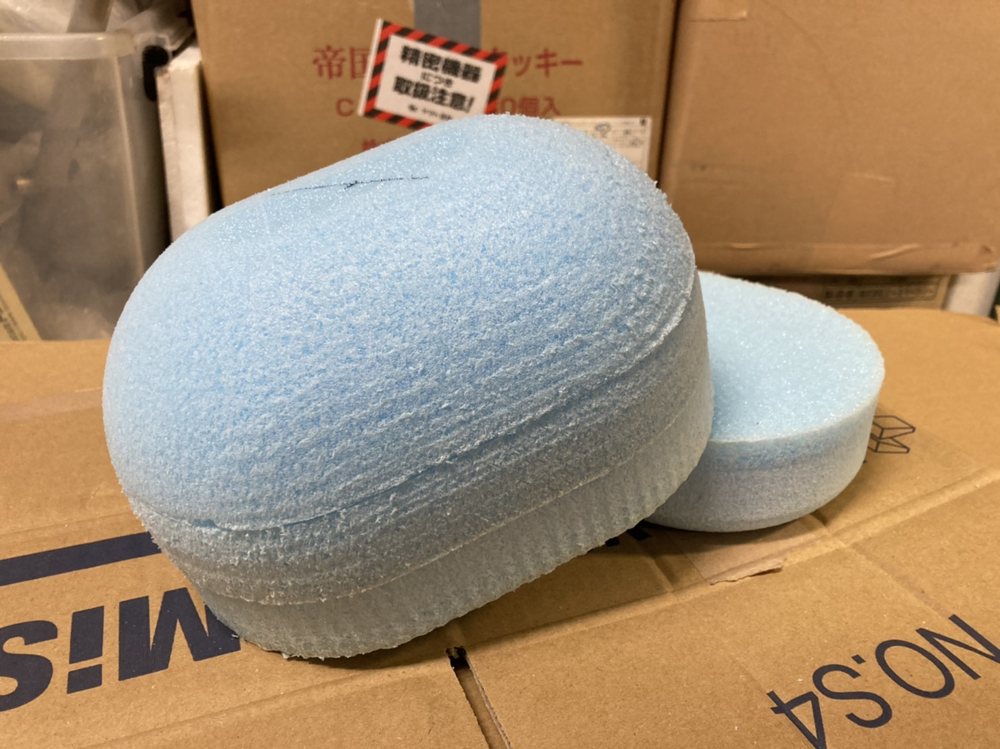

こんにちは．吸気を担当しています，1回の山﨑です．

今回は一月中旬にサージタンクの型作りをしましたので，そのご報告をさせていただきます．

今年度は積層によりサージタンクを製作します．それにあたって今年度のサージタンク用の雌型を作りました．
製作方法としましては，学内にあるＤ-Laboという施設の機械をお借りして発泡材にNC加工を行いました．切削条件を厳しくしたことにより，表面は綺麗に仕上がったと思います．

これから製作期に突入し，本格的に製作が始まります．前期はコロナで車両に触れる機会が少なかった分，とても楽しみにしています．
これからもパワトレ班，そしてチームとしての目標を達成できるように尽力していきます．

Text：Fuma Yamazaki