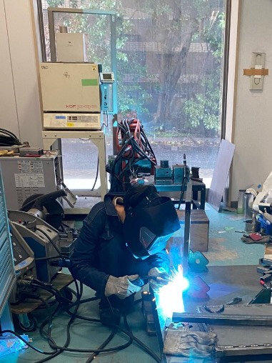

こんにちは．1回生の齋藤です．

先週から製作期が始まりました．製作班はそれぞれ2021年度車両GDF16に搭載する部品を作っています．私は初めての製作期ですので，実際に部品を製作していく，ものづくりができることがとても楽しみです．

私を含め，1回生は2020年度学生フォーミュラ大　会が中止になったことで大会を現地で体験できておりません．ですがもう残り半年ほどとなり，大会に向けての車体を作っていくことで，大会に向けて活動していると実感する機会が増えています．

大会で芳しい活躍ができ，長期計画の達成につなげられるよう1日1日を大切に活動して参ります．今後ともご支援，ご声援をよろしくお願い致します．

Text: Akari Saito