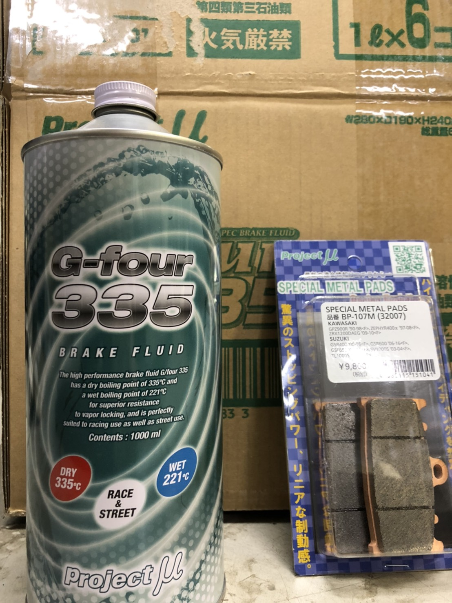

こんにちは，ブレーキ担当の松本です．

先日，株式会社プロジェクトミュー様より，ブレーキフルード，ブレーキパッド等の製品を学生フォーミュラ協賛価格にてご提供頂きました．プロジェクトミュー様はブレーキパーツの総合メーカーとして様々な製品を販売しており，またスカラシップとして学生フォーミュラ以外にも様々なレースチームを支援しておられます．

ブレーキフルードはなんとドライ沸点，ウエット沸点ともに異次元の高沸点が実現された製品であり，弊チーム車両のブレーキシステム信頼性を確保する上でとても重要な製品となっております．

期末試験が終了し，チームは製作期に入っております．新・長期計画に則り三回生である私も例年以上にチームとの関わりを持ちつつ，シェイクダウンに向けて活動して参ります．

[株式会社プロジェクトミュー様](https://www.project-mu.co.jp/ja/)

Text: Koki Matsumoto