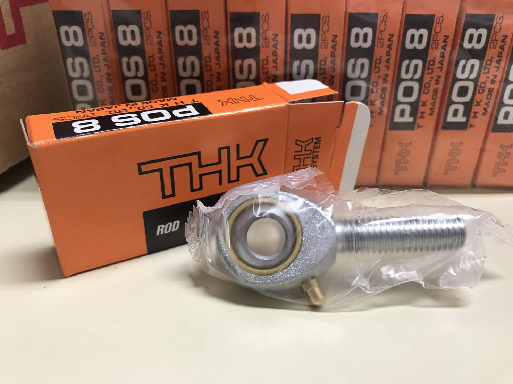

こんにちは，シャシリーダーを務めております2回生の吉松です．
先日，THK株式会社様よりロッドエンドのご支援を頂きました．

THK株式会社様は，ロッドエンドをはじめ，ボールねじ等の様々な機械要素部品を開発，供給されている企業様です．弊チームの車両では，サスペンションを中心に，シャシパーツにロッドエンドを多く使用させて頂いております．

製作期開始から2週間が経過し，パーツが徐々に出来上がるにつれて，いよいよ車両製作をしているという確かな実感が得られるようになって参りました．未だ一部に制限がかかった中での活動ではありますが，引き続き健康面，安全面ともに細心の注意を払いつつ，製作を進めて参ります．

[THK株式会社様](https://www.thk.com/?q=jp)

Text: Momo Yoshimatsu