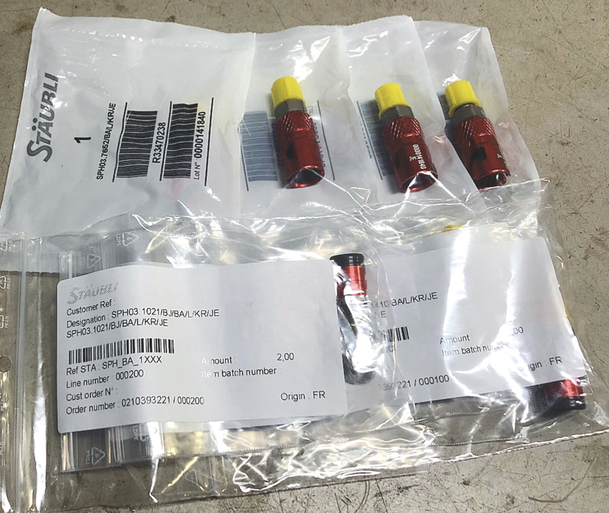

こんにちは，ブレーキ担当の松本です．

先日，ストーブリ株式会社様とオンラインでディスカッションを行い，スポンサーとして製品を依頼して頂くこととなりました．今年度，ブレーキシステムでは様々な取り組みを予定しており，その一環として信頼性，メンテナンス性の向上を目的としてストーブリ株式会社様のクイックコネクタを搭載させて頂きます．

ストーブリ株式会社様は，コネクタ，ロボット，繊維機械の3つを柱に世界29カ国を拠点に事業展開しておられるメカトロニクスソリューションプロパイダーで，この度ご支援頂くクイックコネクティングシステムはMotoGPマシンやF1マシンにも搭載されており，レーシングチームにとってなくてはならないシステムとなっております．

ご支援頂く製品を存分に活かし，ブレーキシステムの開発を進めて参ります．

[ストーブリ株式会社様](https://www.staubli.com/ja-jp/)

Text: Koki Matsumoto