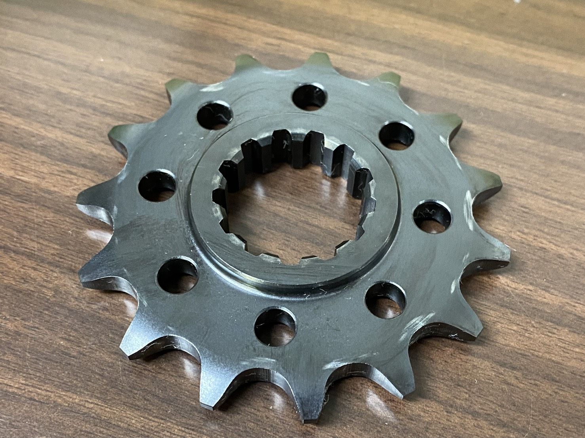

こんにちは，1 回生シフト・駆動担当の土橋です．

先日，国美コマース株式会社様よりエンジン用スプロケットを学生フォーミュラ協賛価格でご支援いただきました．

国美コマース株式会社様は，様々なサイズのバイク用スプロケットやブレーキディスクを販売されています． 

エンジンから駆動輪への動力伝達のチェーン長調整などのために以前と歯数を変更する必要があり，エンジン用スプロケットをご支援いただきました． 

現在，私にとって初めての製作期ですが，自分が加工した部品も搭載され始め車両を製作していることを特に実感しています．引続き，製作に励みたいと思います．

[国美コマース株式会社様](https://www.sunstar-kc.jp/index.php)

Text: Takuma Tsuchihashi