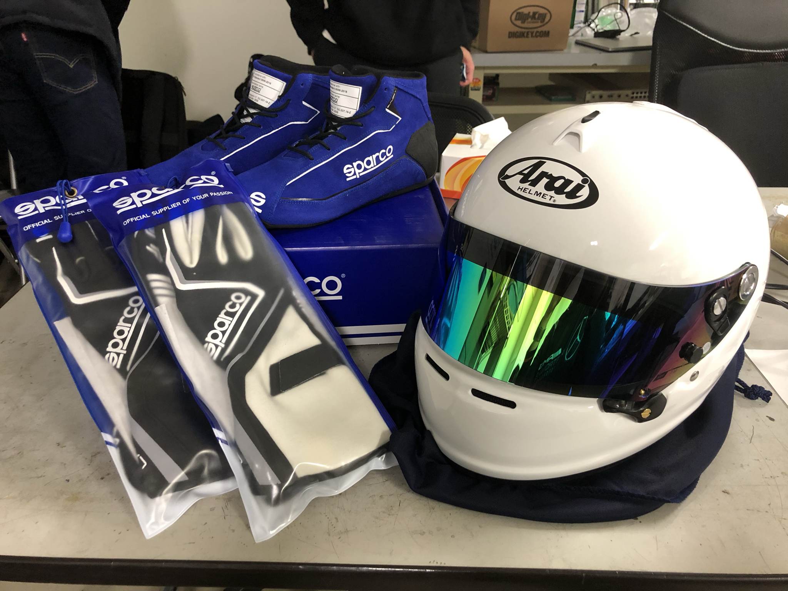

こんにちは．2021年度ドライバーの藤田 寿です．
この度，Star5(有限会社 イルヴェント)様にレーシングギアを特別価格にてご支援頂きました．

Star5様はsparcoを中心に幅広く各種レーシングギアを取り揃えられており，独自のシステムによる発注からの迅速な納品が特徴です．更には，スーパー耐久シリーズ等のレース活動もされておられ，2020年に初参戦ながら5戦中2勝，3度の表彰台＆3連続ポールポジション，シリーズランキング2位など輝かしい実績を残されています．

実は先日，代表の高崎様とお話しできる機会があり，そこで学校からの経費での公費払いの件をご相談したところ快くご承諾頂き，更にそのご縁で特別価格にてご販売頂きました．

今回ご支援頂いたのは大会レギューションで着用が義務付けられているFIA公認の耐火製グローブ，シューズ，ヘルメットになります．今年の大会は心機一転新しいレーシングギアで挑みます．
高崎様、誠にありがとうございました．

[Star5(有限会社 イルヴェント)様](https://www.sparco-japan.com/showroom/official-showroom-star-5/)

Text: Hiroshi Fujita