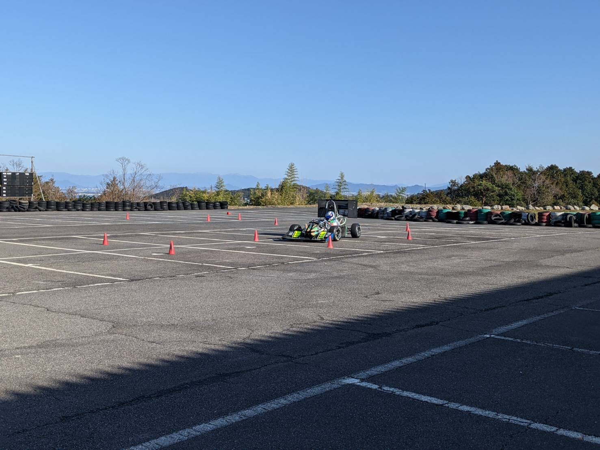

こんにちは，エアロパーツ担当一回生の吉田健悟です．

先日，琵琶湖スポーツランド様にて走行会を行いました．

実走行は少なかったものの，エンジンや電装のトラブルを発見することができ，走行会としては十分意味を持てたと思います．これからは，夏に行われる大会に向けてエラーシューティングを積極的に行い，大会で完走できるようマシンの調整に尽力していきます．

私はまだ知識量が拙く学ばなければいけないことも多いですが，先輩から多くを吸収して，よりよいマシンを作れるよう精いっぱい貢献していく所存です．

Text: Kengo Yoshida