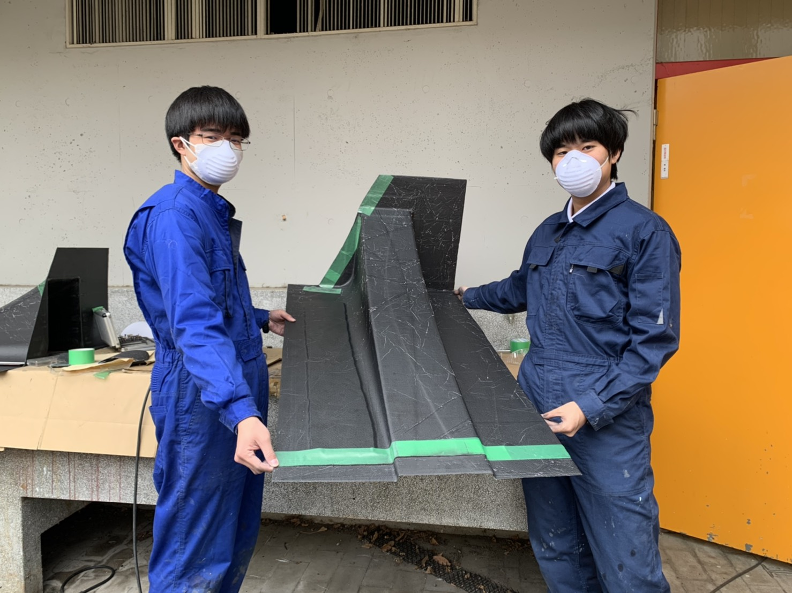

こんにちは，エアロ担当新二回生の佐藤広都です．

エアロのサイドデバイスの一つとして新たにサイドディフューザーを設計，製作しました．東レ・カーボンマジック様からご支援いただいたプリプレグを積層し，オートクレーブをお借りして無事に完成しました．

東レ・カーボンマジック様は学生フォーミュラに積極的にご協力してくださり，弊チームも多大なご支援を賜っております．高度な軽量化設計技術とCFRP整形加工技術により，レーシングカーだけでなく大小様々な製品の設計，生産をされています．高剛性かつ軽量で形状の自由度の大きいCFRPの利用は弊チームでも需要が高まっており，ご支援頂いたプリプレグを用いてエアロパーツだけで無くその他のパーツのカーボン化に取り組んで参ります.

今回完成したサイドディフューザーを搭載し走行できるのを楽しみにしています．更なる精度を求め，これからも設計製作を進めていきます．

[東レ・カーボンマジック様](https://carbonmagic.com/)

Text: Hiroto Sato