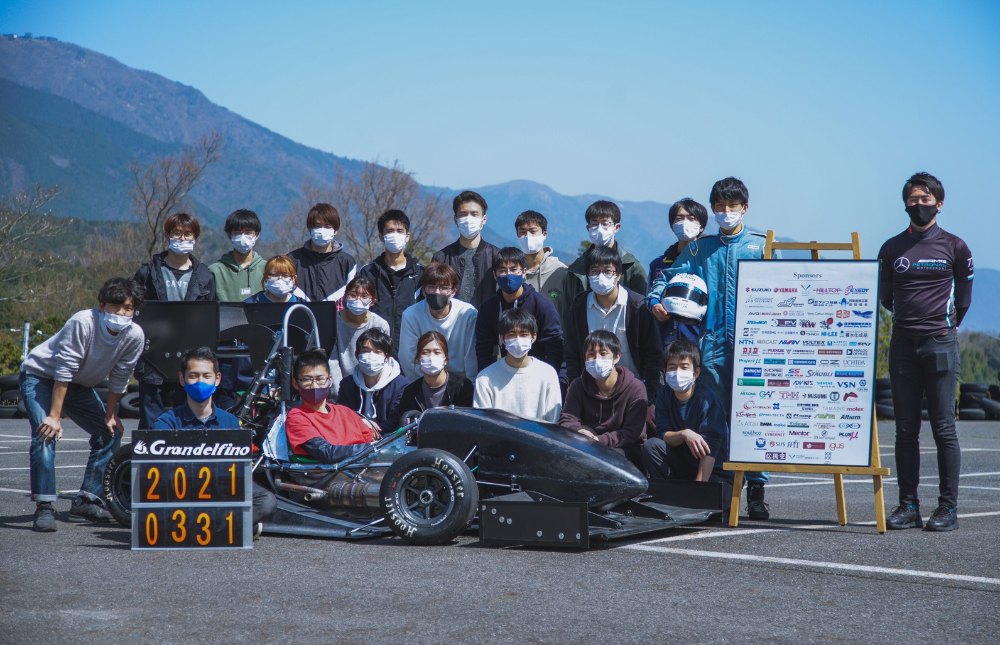

こんにちは！2021年度プロジェクトリーダーの保坂です．段々と寒さが和らぎ，桜の舞うこの時頃，いかがお過ごしでしょうか．

弊チームは3月31日にGDF-16としてのシェイクダウンを行いました．昨年の大会中止や活動休止を受けて，思うように活動が出来ず，つらい日々もございましたが，ご支援くださる皆様や限定的ながらも活動を認めてくださる大学のおかげでシェイクダウンを迎えることができました．

常日頃より応援してくださり誠にありがとうございます．今後は，未搭載パーツに関しては引き続き製作・搭載を行い，大会に向けて車両性能の改善に取り組んで参ります．また，新年度を迎えて新入生向けの説明会なども行って参ります．興味を持たれた方は以下のリンクよりご連絡ください！

[Grandelfino連絡先](https://lit.link/grandelfino)

Text: Shoma Hosaka