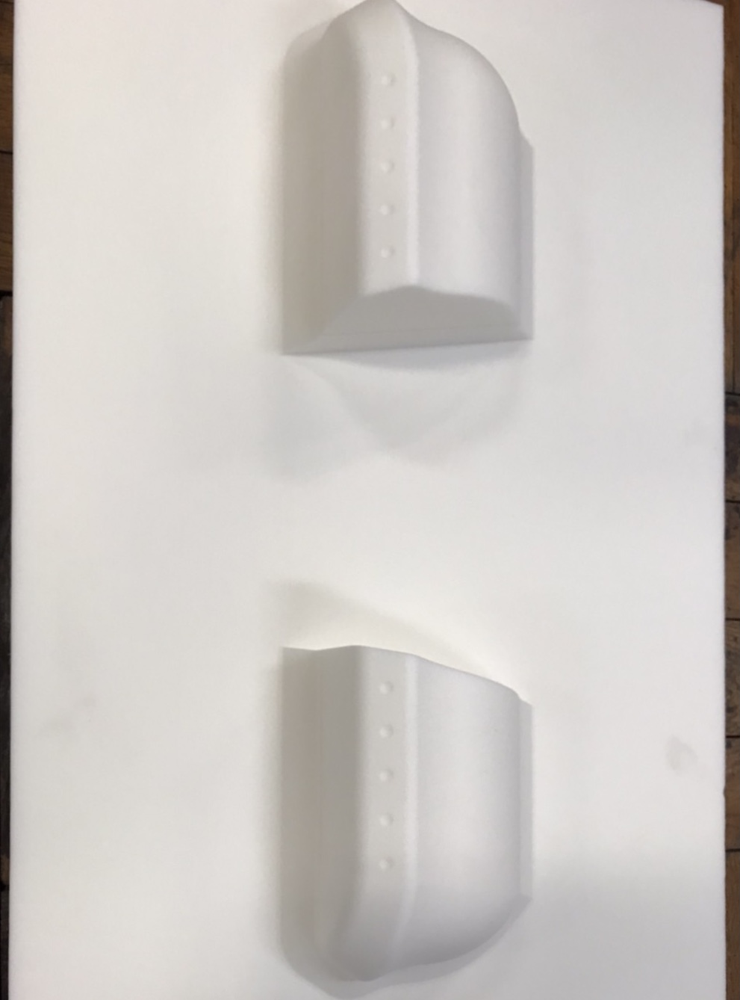

こんにちは．エアロパーツ担当2回生の吉田健悟です．
この度岩井木型製作所様に，ブレーキダクトを支援していただきました．

ブレーキダクトとは，ブレーキの冷却を目的としたタイヤ内側に搭載されるパーツであり，マシン走行中の空気の流れを利用したより効率の良い冷却をできることが望めます．
弊チームの車両に搭載するのは今年度が初の試みとなります．手探りの状況ではありますが，マシンの性能を少しでも向上できるよう，大会までの走行会でデータを集めて検証を重ね，改良して参ります．

4月に入り，私自身2回生になったという自覚はまだ芽生えておりませんが，新入部員を多く獲得し万全の状態で大会に望めるよう，部員一同精進して参ります．

[岩井木型製作所様](http://www.tec-iwai.com/)

Text: Kengo Yoshida