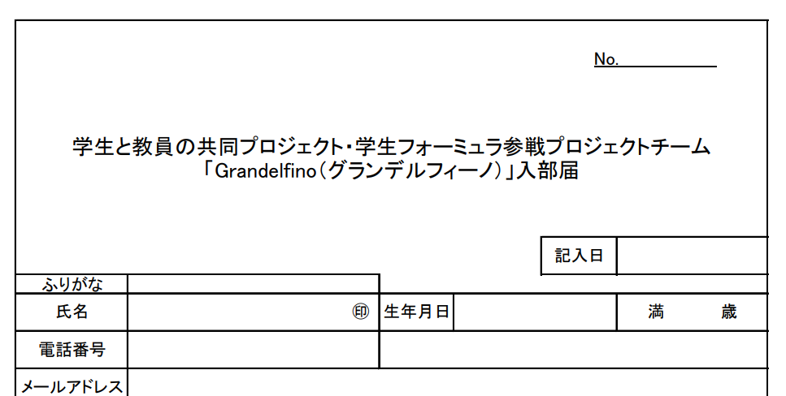

こんにちは．2回生RBH，IA担当の齋藤です．
4月末で新しく11名がGrandelfinoに入部してくれました！

この間のゴールデンウィークより，先輩方からの講習を受けてもらっています．緊急事態宣言の最中であり，対面での1回生との活動は厳しいため，講習はオンラインで開催しています．ですが，1回生も自分から積極的に部室が開いている時間に足を運んでくれ，実際にCADを使って簡単なものを作るなど，少しではありますがフォーミュラの活動に触れてもらっています．

私としては，自分達がもう上回生のうちに入ってしまったのが少し悲しいですが，上回生の自覚を持って意識を変えて活動していかなければならないなと思っております．

これから大変なことも多いかもしれませんが，その分やりがいのある貴重な経験ができると思うので，一緒に頑張っていきましょう．

まだまだ新しいご参加お待ちしています！気軽にご連絡ください．また，活動は平日16:00〜19:00で行っていますので少しでも興味があればお越しください！

[Grandelfino連絡先](https://lit.link/grandelfino)

Text: Akari Saito