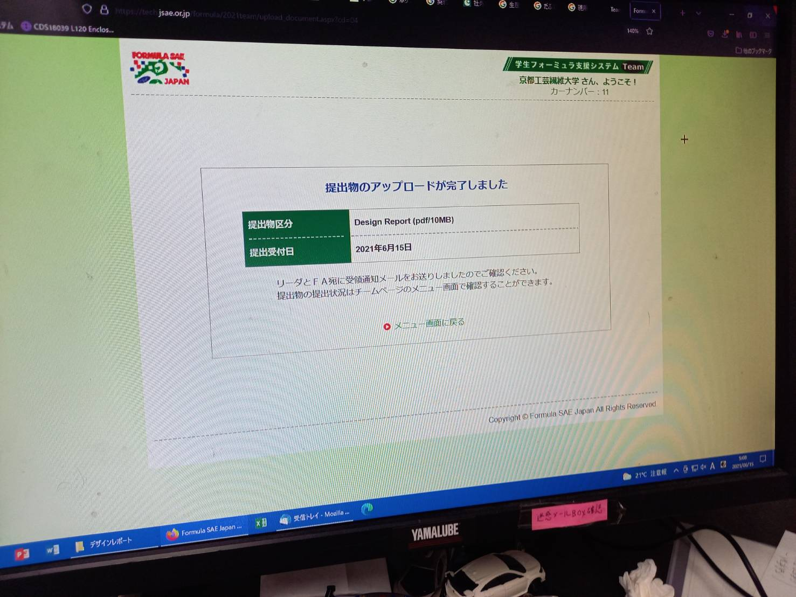

こんにちは．3回生の水谷です．
先日デザインレポート，スペックシート，動画を提出しました．デザインレポートには自分たちがどのような考え，理論でマシンを設計開発し，どのように評価するかを示しました．何度も会議を重ねより良いレポートにするために努力しました．また今年度から新しく出来たデザイン動画は内容，編集方法など何も無いところからのスタートであったため大変難しかったです．

今後はオンラインでの当日発表へ向けて，発表資料の作成，マシンの実測，評価を行います．
今後ともご声援のほどよろしくお願いします．

Text: Taiki Mizutani