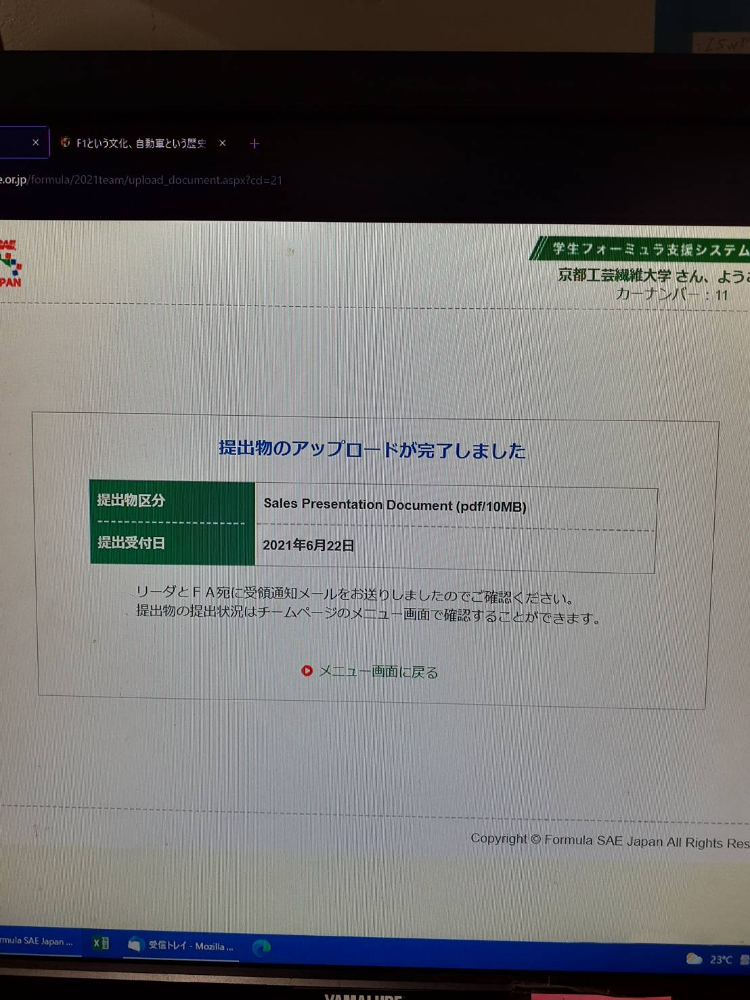

こんにちは．2回生の吉田です．先日，静的審査資料であるセールスプレゼンドキュメント（SPD）の提出が完了しました．SPDでは幣チームが企業であり，マシンを販売すると仮定して市場分析を行い，私たちのマシンの強みを生かした販売戦略を示しました．私たち2回生は初めての資料作成となりましたが，OBの方達の助言を頂き，上回生の先導のもと無事完成させることができました．

今後は8月末に控えるオンラインでの発表に向け，資料の作成に励む所存ですので今後ともご声援の程，宜しくお願い致します．

Text: Kengo Yoshida