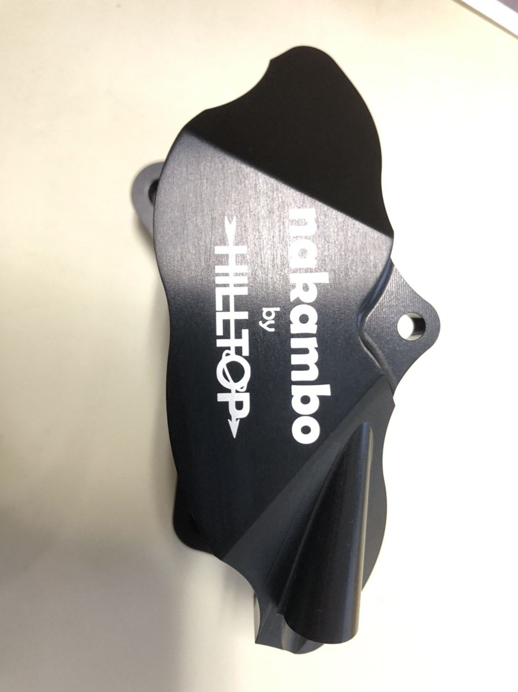

みなさん，こんにちは．ブレーキシステム担当の松本です．

先日，ブレーキャリパの動作試験を行いました．今回試験を行ったブレーキキャリパは，株式会社アドヴィックス様や東京電機大学様の助言を頂きながらチームで独自設計を行い，キャリパ本体をHILLTOP(ヒルトップ)様，ピストン蓋(写真参照)を有田製作所様に製作して頂いたチームオリジナル製品となっております．また，ブレーキパッドはプロジェクト・ミュー様にご支援頂いております．

このブレーキキャリパはモノブロック構造となっており，従来の2ピース構造に対して優れた比剛性を備えています．今回のブレーキキャリパ単体での試験ではピストンの摺動性や組み付けやすさなどを確認することが出来ました．

今後はストーブリ株式会社様ご支援頂いたクイックコネクタを活かしつつ，走行試験によって従来品との比較を行いながら，全開走行での制動力や耐久性を確認し，日本大会で初となる(弊チーム調べ)オリジナルブレーキキャリパ搭載を目指して活動して参ります．

Text : Koki Matsumoto