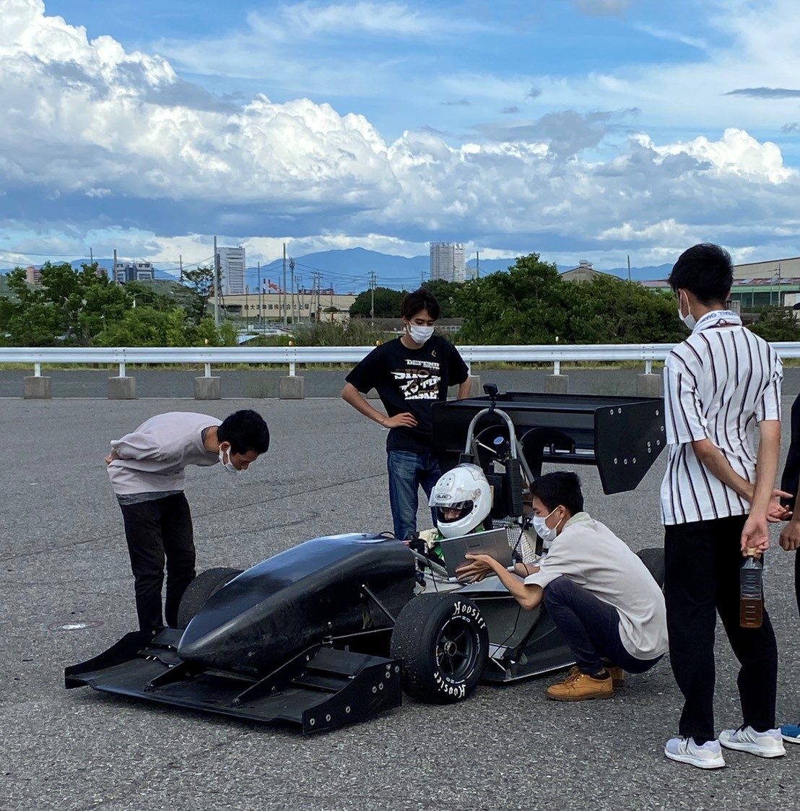

こんにちは！二回生の佐藤広都です．

7月17，18日に泉大津にあるフェニックス多目的広場で走行会をしてきました！エンジン調整後初の走行会でエンジン音が気持ちよく，本領発揮か？という感じでした．

今回の走行会では，ドライバー選考を兼ねていたようですがどうなったのでしょう？マシンの速さを決める大きな要因の一つであるドライバーの技量も勝つためには必要不可欠です．タイムアタックに挑むドライバーの表情は真剣でやはりかっこいいですね．

今回は今季初の2日連続の走行会ということで，気温も高く体力的にもキツかったですが，僕個人としては大きな喜びが一つありました．ドライバーデビューです！二回生の自分と一回生からもう1人，新たにドライバーが誕生しました．現ドライバーの先輩方からいろいろ教えていただき，楽しんで無事走行することができました．まだまだ慣れるには練習が必要ですが次の世代に向けて勉強していこうと思います．

また今回初めて2回生主体でマシンを動かしたこと，そしてそれをコックピットから見ることができたことに感動しました．自分たちの代も近づいているのだと改めて自覚し，ますますやる気が出てきた瞬間でした．

大会まであと1ヶ月半，走行できる機会も限られてきているので，時間を大切にラストスパート挑んでいきたいと思います．

頑張るぞー！

Text: Hiroto Sato