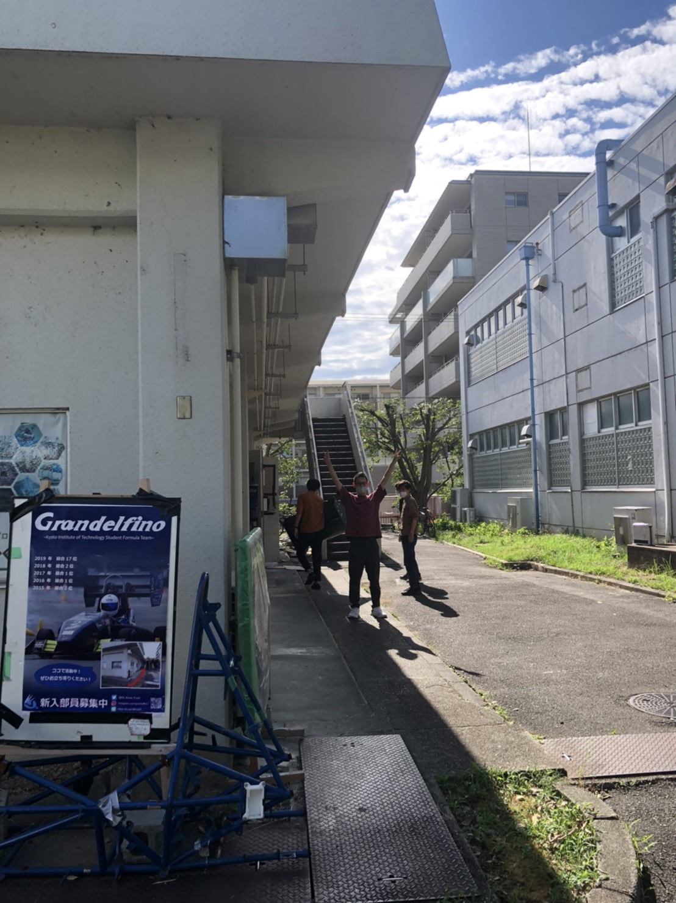

こんにちは．2回生の齋藤です．

　先週，テスト週間が終了しました！テストの出来栄えは置いておいて，待ちに待った夏休みです．昨年はコロナ感染症の影響で学校開始が遅れたため，夏休み期間も少なくなってしまったので，2回生の私は今回が初の大学の夏休みと思っています．

　現在，私達は大会の静的審査に向けて尽力しているところです．現地開催の中止により少し余裕ができましたので，静的審査は主に3回生に指導して頂きながら，我々2回生が中心となって進めていくこととなりました．来年の大会に向け，自分達で進めるという経験がきちんとできるように積極的に取り組んで参りたいと思います．

　大学生の夏休みは今までと違い，学校から出される課題もなく，2か月という長い期間があるので自分磨きにもってこいの時間だなと感じております．意識高く一日一日を過ごし，自分のスキルを高められるように無駄のない夏休みを送りたいと思います．

Text: Akari Saito