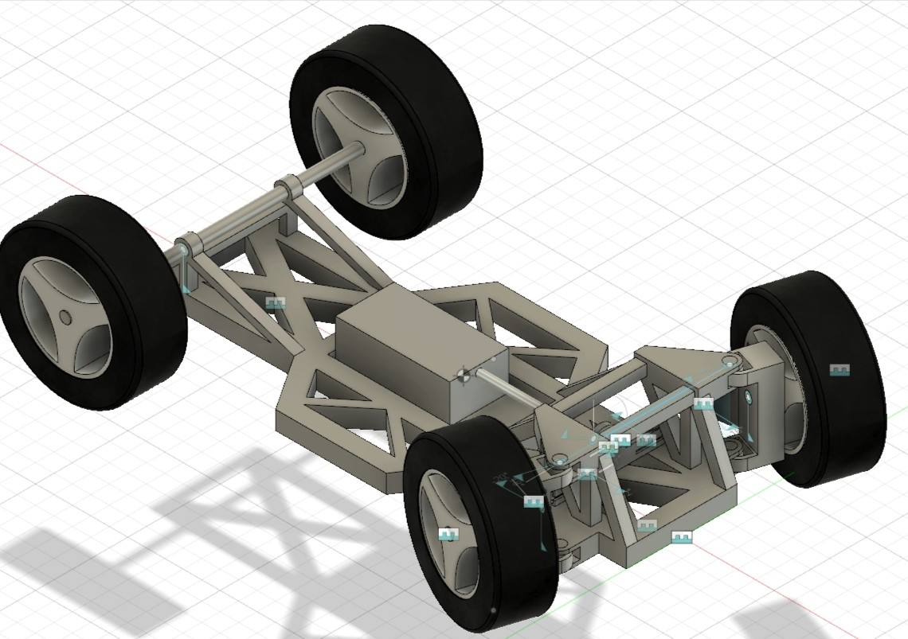

こんにちは，1回生の辻畑です．先日１回生が行っていたミニカー講習が終了しました．

これは年間を通した学生フォーミュラの活動を，ミニカーを設計することで体験するといったものです．３チームに別れて計画をたて，どんなミニカーを作るのかを決め，CADを使って設計し，コストやデザインの資料を作成しました．実際の学生フォーミュラの活動に沿ってミニカーを設計し，これからの活動を理解することができました．

 

３チームそれぞれ全く異なった車両を設計してきて，同じ条件で作業してもこうも違った物が完成するのかと驚きを感じました．チームで同じ目標を掲げて協力して作業することで，早くも１回生で団結力が生まれているような気がします．

 

昨年と今年は大会の動的審査が行われず，部内で技術継承に注力されている現状で，自分たち１回生が積極的に成長していかなければならないなという意気込みが日を追って強くなっています．

 

まだまだ成長中の１回生ですが，精進して参りますので今後ともご声援の程よろしくお願いいたします．

Text: Hiroki Tsujihata