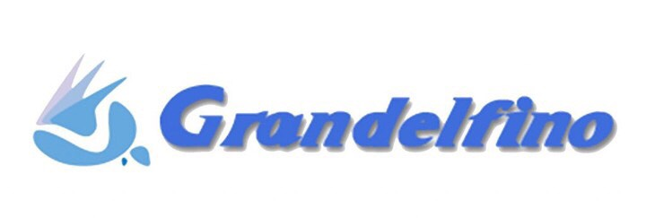

こんにちは．2022年度のプロジェクトリーダーとなりました．吉田健悟と申します．\
 \
今年度は2020年度に引き続きコロナウイルスの影響を受け大会の現地開催をすることができず，大会の地を駆けることはできませんでした．しかし，オンラインで開催された静的審査においては部員一同が目標に向けて取り組み，総合順位6位となり順位目標を達成することができました．車両製作においては３ヵ年計画の初年度として変更したエンジンの性能を発揮できる車両を製作し，春のシェイクダウン以降，走行距離を重ねて多くのデータを取得致しました．ご支援頂いたスポンサーの皆さまには，動的審査での実績を残すことができずやり切れない気持ちでいっぱいですが，来年の大会で現地開催がなされた暁には，常連校として確固たる結果を出せるよう精進して参りますので，今後ともご支援・ご声援の程何卒宜しくお願い申し上げます．\
 \
2022年度は2021年度に引き続き，史上初の4連覇を達成するべく，各開発事項について吟味し，さらなる性能向上を目指して参ります．代替わりを行い新たなメンバー体制となりましたが，これまで先輩方が培ってきたものを受け継ぎ，車両の開発を進めて参ります．今後とも弊チームをよろしくお願い致します．

Text：Kengo Yoshida