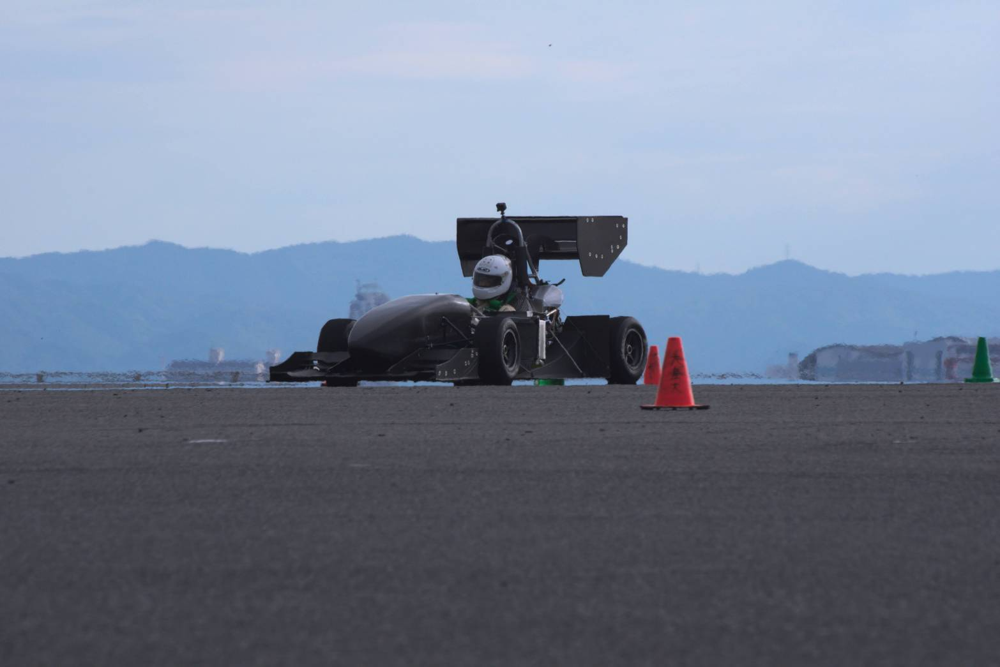

こんにちは，1回生の向井直です．

9月19日に泉大津フェニックス多目的広場で走行会を行いました．今回はフルコースを20周走行するエンデュランスシミュレーションの予定でしたが，トラブルが発生してしまい，予定通りに走行することができませんでした．しかし，課題が見つかり，ドライバー練習も行うことができたので，収穫のある走行会であったと思います．

私は今回が2度目の走行会で，前回と同様に，コース脇で旗を振ってドライバーに指示を送るポストという役割を担いました．走行するマシンを間近で見ることになるので，緊張しましたが，これから私たちがそれを製作することになると考えると，とても楽しみになりました．

私はエアロ担当なのですが，初めてマシンにエアロパーツを取り付ける作業も行いました．まだ作業にあまり慣れておらず，どうしても失敗や質問が多くなってしまいますが，先輩方が丁寧に教えてくださり，作業を進めることができました．エアロ担当として，これからも教わったことを身につけ，できることを増やしていきたいと思います．

1回生は作業や講習が増え，いよいよ本格的に学生フォーミュラの活動に関わるようになってきたと感じます．分からないことも多いですが，仲間や先輩方を頼りにし，これからも成長していきたいと思います．今後ともご支援・ご声援の程よろしくお願いします． 頑張らねば！

Text: Nao Mukai