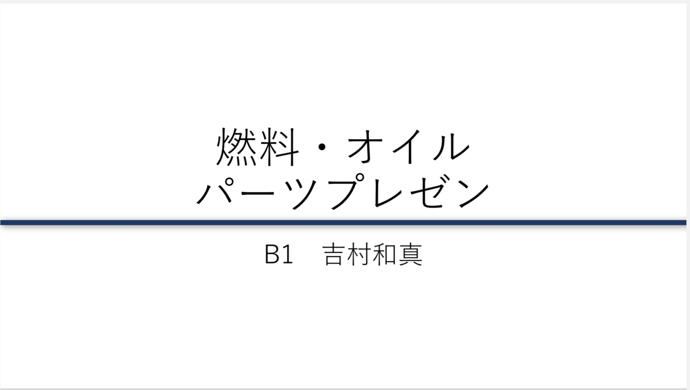

こんにちは，1回生の吉村です． 先日，先輩方，OBさんの方々に向けて各パートのリーダーとパーツ担当者が，GDF-17の設計方針についてプレゼンを行いました．

マシンコンセプトや目標の達成のために，問題解決案や具体的な設計方針について様々なアドバイスをいただきました． 私たち1回生にとっては，自分のパーツだけでなく他のパーツについても，理解を深めるよい機会になりました．しかし，まだまだ知識不足だと感じる点も多いので，先輩方に積極的に質問をするなど，受け身ではなく自分から学びに行くという姿勢で，これからも精進してまいります．

これから本格的な設計期に入りますが，頂いたアドバイスを活かしながら，1人1人が各パーツの責任者であるという自覚を持って，設計に努めたいと思います．今後ともご支援・ご声援の程よろしくお願いいたします．

Text: Kazuma Yoshimura