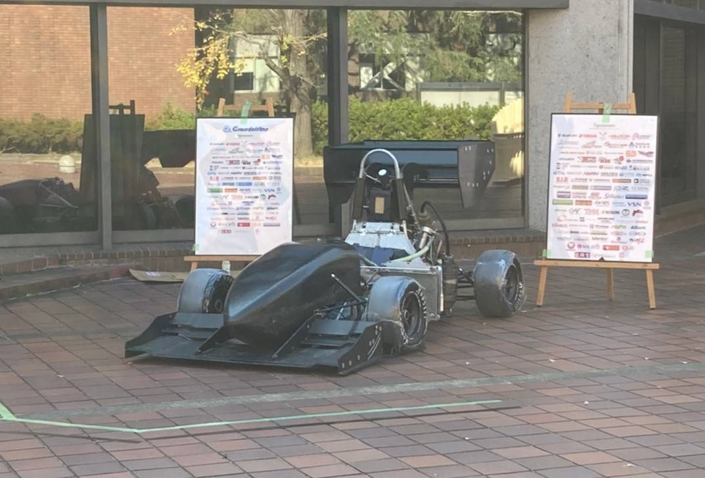

こんにちは．一回生の辻畑です．\
\
　先日松ヶ崎祭が行われました．現在はコロナ禍が一旦の落ち着きを見せており，感染に注意しながらも今年度は無事開催することができました．今回私たちGrandelfinoはマシンの展示と写真撮影を行いました．エアロパーツを着けたG16車両はいつもより格好良く見え，自分が二回生三回生になった時，しっかりと車両を完成させられるように成長していかなければなと感じます．今回の松ヶ崎祭は一般の方々に車両に触れてもらう数少ない機会であるため，しっかりと楽しんで見てもらえるように注力できたと思います．\
\
　現在，Grandelfinoでは設計が大詰めに差し掛かっています．我々一回生もどんどん車両の設計に関わり始めており，ますます気が引き締まる思いです．2022年度の大会に向け，これからさらに尽力してゆく所存ですので今後ともご支援・ご声援の程よろしくお願いいたします．

Text:Hiroki Tsujihata