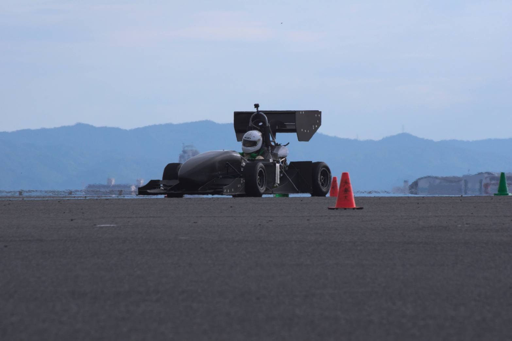

新年あけましておめでとうございます．プロジェクトリーダーの吉田です．

2021年度大会では動的審査は中止となってしまったものの，オンラインでの静的審査で総合6位を獲得することができました．車両に関しても試験走行でのデータを取得し，今年度車両であるGDF-17に向けた開発への糧とすることができました．

これは偏に日頃から私達の活動を支持してくださる家族や大学関係者の皆様，スポンサーの皆様のおかげです．改めて昨年の多大なご支援にお礼申し上げます．

2022年度では史上初の4連覇を最終目標とする計画を昨年度より引き継ぎ，載せ替えたエンジンのスペックを最大限活かす開発を行って参ります．

現在では各パーツの設計も終盤となり，今後は春休みに控える車両製作期に向けて干渉確認等を行って参ります．

大会経験が無い部員が大半となる状況下での活動にはなりますが，上級生やOB・OGの先輩方のお力添えを頂きながら大会での好成績を目指して部員一同精進して参ります．

最後にはなりますが，今年の皆様の益々のご繁栄をお祈り申し上げますとともに本年も弊チーム”Grandelfino”へのご支援・ご声援の程何卒よろしくお願い申し上げます．

Text : Kengo Yoshida