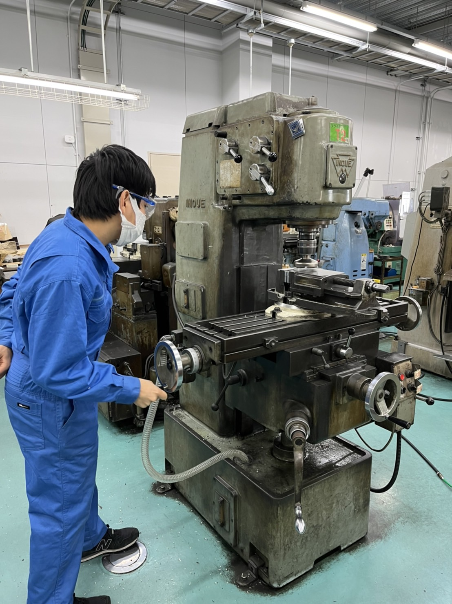

こんにちは，１回生電装担当の辻畑です．

報告が遅くなりましたが，先日，私たちグランデルフィーノは2022年度の大会のエントリーを完了致しました．前回，前々回の大会は新型コロナウイルスの影響により動的審査で競うことが出来ませんでしたが，今回の大会ではきっとマシンを走らせて競い合うことが出来ると信じております．

現在，グランデルフィーノは製作期に入りました．自分は旋盤加工を担当してパーツを作っていくのですが，ここでのクオリティはマシンの設計をより正確に反映させられるか否かに関わって参ります．そのため，より一層気を引き締めて活動したいと思っております．

これから慌ただしく作業に取りかかる日々になると思われますが，日々確実に成長していく所存ですのでこれからもご支援の程よろしくお願いします．

Text:Tsujihata Hiroki