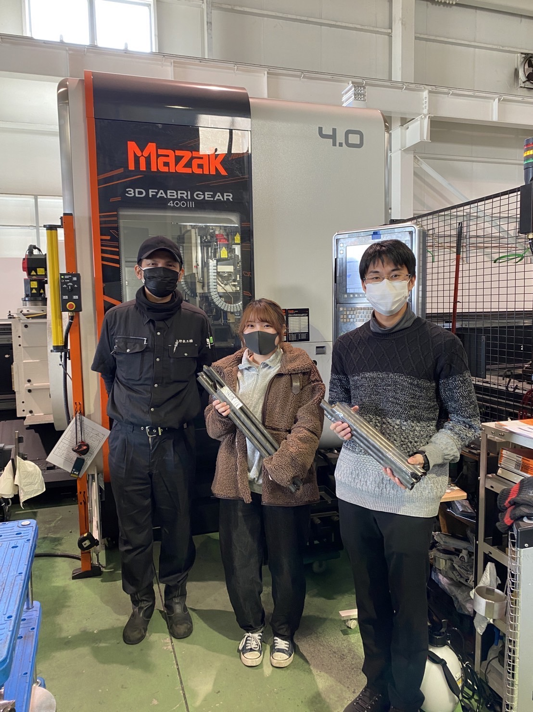

こんにちは，フレーム担当の西村です．

上野鉄工株式会社様にフレームパイプの端面加工ご支援をして頂きました．上野鉄工株式会社様は最先端の二次元・三次元レーザー加工を用いた，幅広い加工をされています．

これまで弊チームでは何十本ものパイプ端面処理を，グラインダーを使用し手作業で行っていました．
今回加工支援をして頂いたことにより，加工時間の大幅な短縮および高精度でフレーム製作を進められています．

レーザー加工されたパイプを扱ったことがなかったので，パイプがCAD通りぴったり合うのを見てとても感動しました．
もうすぐフレーム溶接が始まるので、きれいな端面を活かした製作ができるように頑張ります．

今後ともgrandelfinoをよろしくお願いいたします．

[上野鉄工株式会社様](https://www.uenotekko.co.jp/)

Text:Nishimura Nanaka