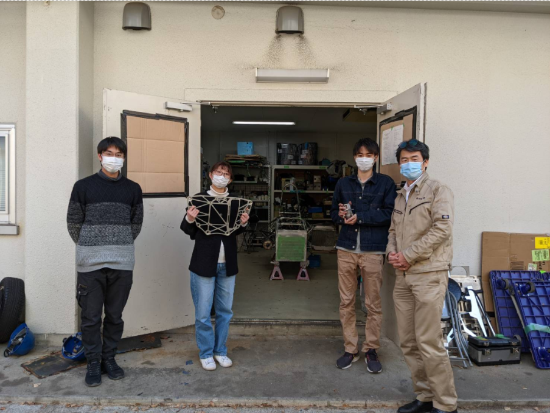

こんにちは． 

2回生リアバルクヘッド(RBH)担当の齋藤です． 

この度，有限会社日双工業様にRBH，ハブの製作をして頂きました．有限会社日双工業様には毎年様々な製作を依頼させて頂き，大変お世話になっております．今回依頼をしたRBH，ハブは共にシャシを構成する重要なパーツであり，ハブに関しましては，前年も有限会社日双工業様に製作をお願いしています． 

RBHは昨年度設計よりもさらに小さくなり，軽量化や剛性の向上を目指しました．設計者としてCAD上で設計していたものが，実際に実物として手にすることができ，とても嬉しいです． 

今後とも設計改良を重ねられるよう精進して参ります．有限会社日双工業様，この度は製作をして頂き誠にありがとうございました．今後ともどうぞよろしくお願いいたします．

[有限会社日双工業様](https://www.nisso-k.co.jp/)

Text: Akari Saito