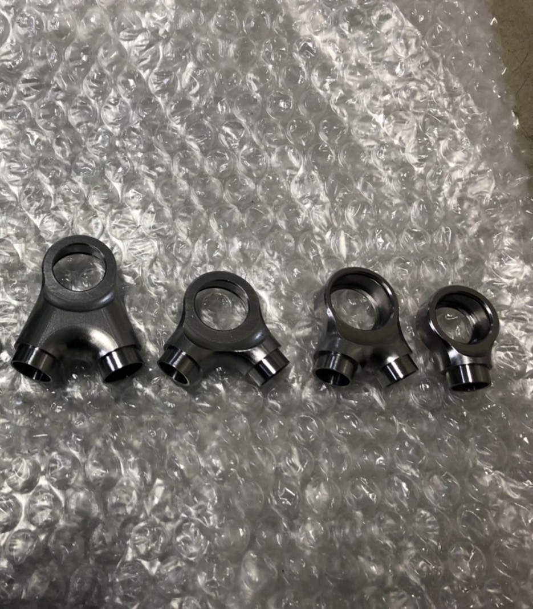

こんにちは，二回生サスペンション担当の原です．

先日，丹後機械工業協同組合様にアームエンドの加工支援をして頂きました．アームエンドは路面からの入力によって大きな荷重を受ける重要なサスペンション部品です．求められる車両の運動性能を満たすため，軽量かつ高剛性を目標に設計を進めました．

製作期も後半となり，シェイクダウンに向けて徐々にマシンが形になってきました．今回ご支援を頂いたアームエンドの溶接も含め，残りのパーツ製作にチーム一丸となって尽力して参ります．今後ともご支援のほどよろしくお願いいたします．

[丹後機械工業協同組合様](http://tango-tc.jp/)

Text : Ryoka Hara