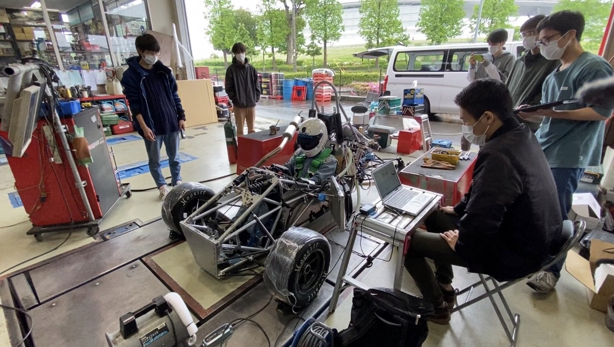

こんにちは，2回生の吉村です．

先日，ZEAL by TS-SUMIYAMA様にシャシーダイナモをお借りし，トルク・出力の測定及び燃調・点火時期のセッティングを行いました． 

必要な機器や場所をお貸しいただいただけでなく，測定やセッティングに必要な知識も教えていただきました． 

セッティングは順調に進み，同時に様々な問題も発見することができました。この結果を踏まえ，評価・改善を行い9月の大会に向けてさらに良い車両にできるよう精進して参ります． 

静的審査の書類の提出も迫り，忙しい時期ですが日々確実に成長していく所存ですのでこれからもご支援のほどよろしくお願いします

[ZEAL by TS-SUMIYAMA様](https://tss-zeal.com/)

Text : Yoshimura Kazuma