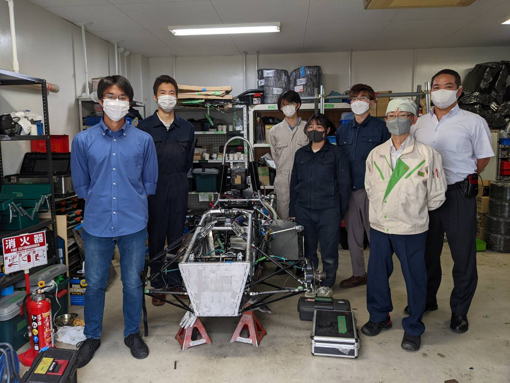

こんにちは，2回生の日比野です．

先日，木内計測様にお越しいただき溶接の講義を行っていただきました．弊チームでは，パイプフレームや排気管（マフラー），タンク類等を溶接にて自作しており，講義では実際に製作したものを見ていただき，また実際に溶接練習をしながら指摘をいただいたことで，品質向上の余地がまだまだあると痛感しました．
これからも溶接の練習を積んで，今後の製作ではさらに品質を上げるために精進して参ります．

[木内計測様](http://kiuchi-ins.co.jp/)

text : Hibino Kohei