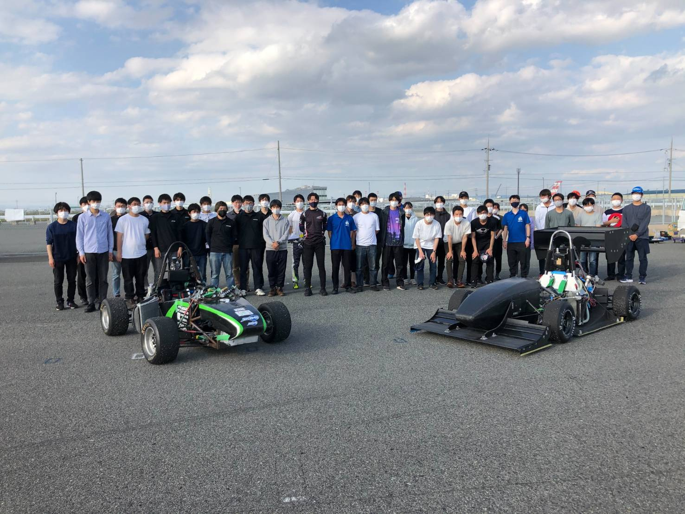

こんにちは，1回生の向井です． 

5月14日に泉大津フェニックス多目的広場にて，大阪大学フォーミュラレーシングクラブ様と合同で試験走行を行いました． 

今回はすべてのエアロパーツを搭載した状態で初めてのミニコースの走行となり，様々なトラブルを発見することができました． 

エアロ担当である自分にとって，自分が製作に関わったパーツを搭載しての走行を見るのは初めてであったため緊張しましたが，走行しているマシンを見て大きな達成感を得ることができました． 

また，今回は1回生にとって走行するマシンを見る初めての機会となりました．今回の試験走行で経験したことも活かし，今後の活動に励んでいってもらおうと思っています． 

今年度の大会に向けて精進して参りますので，ご支援・ご協力の程よろしくお願いいたします．

text : Mukai Nao