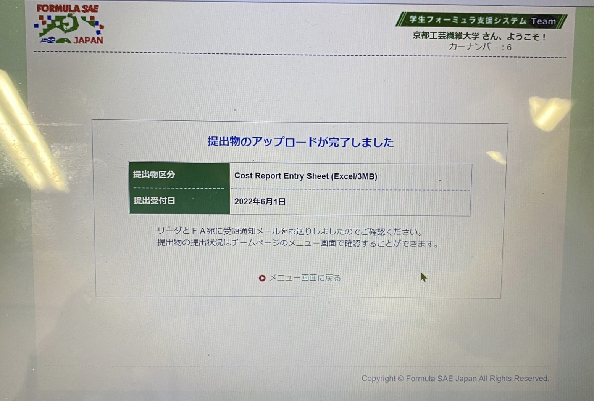

こんにちは,2回生の井澤です.\
6月1日に静的審査におけるコスト資料の提出を行いました.

\
弊チームでは大学の春季休業期間より車両の製作と並行して資料の作成に励んで参りました．慣れない作業に戸惑うこともありましたが，無事に完成させることができました．コスト資料の提出がオンラインになり，今年で2年目でしたが，昨年の経験と反省を活かして資料の作成ができたと思います．\
またコスト資料の作成を通して，車両に搭載するパーツをどのような工程を踏めば量産できるかや，どのような加工法があるのかなど学ぶことが多くありました．エンジニアを志す人間としてとても貴重な経験だったと感じております．

\
今後は提出期限が迫るデザイン審査とプレゼン審査における資料作成に加え，車両の更なる改善に精進して参ります．今年度の大会に向け態勢を整えて参りますので，今後ともご支援・ご声援のほどよろしくお願い致します．

Text: Shogo Izawa