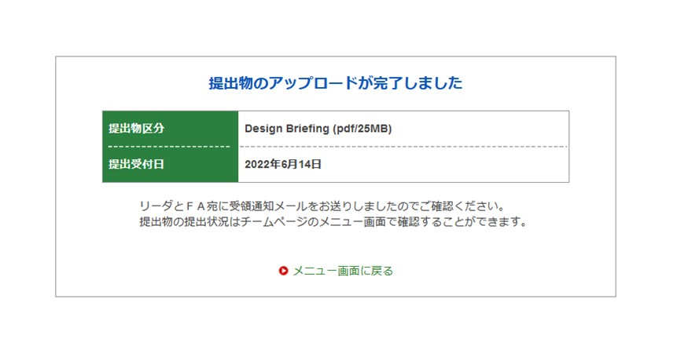

こんにちは，2回生サスペンション担当の大西です．
6月14日に静的審査におけるデザイン資料の提出を完了しました．

弊チームでは3年生を中心に3月ごろからデザイン資料の作成に取り組んで参りました．私自身も資料の最終修正のお手伝いをさせていただきました．デザイン審査では，マシンのコンセプトや設計思想，評価方法などを評価してもらいます．今年度は特に提出書類の書式が変更になり，前年度よりも多くの項目について記入する必要がありました．そこでデザイン資料の担当者たちで何度も話し合いを行い，完成度を高めている姿をよく目にしました．
来年度は私達が主体となって作成するため，どのようなことを考えて記入したのかをしっかりと引き継いでいこうと思います．

今後は引き続き大会に向けてプレゼン資料の作成や，試験走行を重ねてマシンのブラッシュアップを行って参ります．今年度の大会に向け態勢を整えて参りますので，今後ともご支援・ご声援のほどよろしくお願いいたします．　

Text:Kentaro Onishi