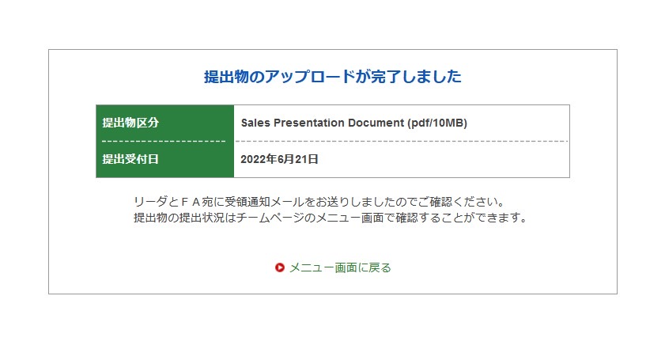

こんにちは，2年生の佐々木です．

先日の6月21日に大会の静的審査の種目の一つであるプレゼン審査の資料の一つであるSPD(Sales Presentation Document)の提出が期限内に完了しました．

弊チームでは現役メンバーである2回生から4回生のメンバーと，プレゼン審査に向けた資料の作成に取り組んで参りました．
私自身プレゼン審査の担当メンバーの一人として一連の活動に携わってきました．
プレゼン審査では各チームがフォーミュラマシン設計会社として，マシン製作会社である審査員の方々に販売戦略などをプレゼンして車体を製造していただくという設定で行われます．
SPDとはその販売戦略や企業の在り方などについて詳細に記述された書類であり，提出のため何度も会議を重ね，ブラッシュアップを行ってきました．
実際に自分たちが社会の一員として働き始めるまでに非常に貴重な経験をさせていただいていると思います．
今後は実際のプレゼンに向けてスライドの作成や練習を行っていきます．今後も止まることなく準備を進めてまいりますのでご支援・ご声援のほどよろしくお願いいたします．

Text:Jun Sasaki