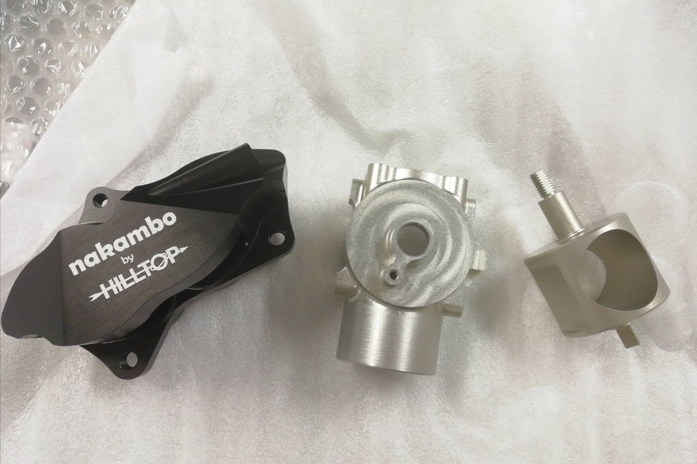

こんにちは，2回生吸気担当の西村です．

HILLTOP(ヒルトップ)株式会社様にスロットルボディ，ブレーキキャリパー，アップライト，オイルパン，オイルポンプを製作していただきました．

HILLTOP(ヒルトップ)株式会社様は自動車や精密機器部品などの金属加工を行っている会社です．弊チームはこの度，ディスクを挟み込み制動力を生むブレーキキャリパー，アクセルペダルと連動して吸入する空気量を調整するスロットルボディ，ホイールを高い強度を以て固定するアップライト，エンジン下部でオイルをせき止めるオイルパン，オイルを全体に循環させるオイルポンプ，これらのパーツをご支援して頂きました．

大会も近くなってきておりますので，本番仕様として各パーツを調整して本番に向けて着実に備えていく所存です．皆様には今後ともご支援・ご声援のほどよろしくお願いいたします．

Text: Yuki Nishimura

[HILLTOP株式会社様](https://hilltop21.co.jp/)