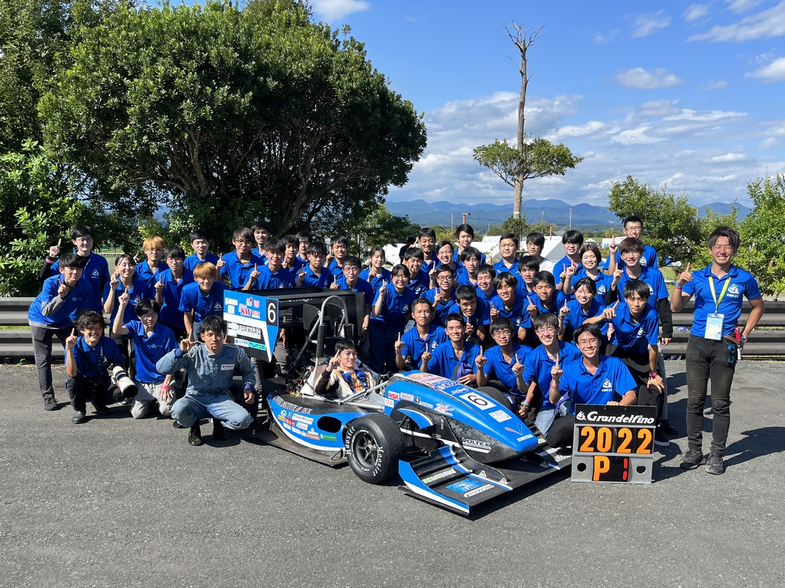

こんにちは，2022年度プロジェクトリーダーの吉田です．

 

9月10日を持ちまして，今年度大会の種目が全て終了しました．弊チームは，見事総合優勝をすることができました！

 

今年度を振り返ると，多くの人に支えられた一年でありました．大会経験のない私達が幹部となり，スケジュールやメンバー管理など，チーム運営について手探りの状況ではありました．しかし，上級生の先輩方や社会人のOB・OGの方々に手助けを頂いた事でチームの運営をより円滑にすることができました．また，我々の活動を応援して頂いている学校関係者の方々，スポンサー企業の皆様，そして各メンバーの家族に支えられたことにより，無事にスケジュール通りマシンを完成させ，大会に向けて準備を進めることができました．

今回優勝することができたのは，チームに関わって頂いた全ての方々のお陰です．

改めて，今年度の弊チームに力をお貸し頂いたすべての皆様に心より感謝御礼申し上げます．

 

これからは，2022年度に主体となったメンバーは裏方としてチームに関わることとなり，来年度大会へ向け代替わりを行います．

次世代のチームもさらなる車両性能向上に向けて邁進して参りますので，これからもGranfelfinoを何卒よろしくお願い申し上げます．

 

最後に，今年度獲得した賞をご紹介し，締めの挨拶とさせて頂きます．

 

総合優秀賞(1位)

経済産業大臣賞

掛川市長賞

袋井市長賞

日本自動車部品工業会会長賞

ICV総合優秀賞

デザイン賞(1位)

コスト賞(1位)

プレゼン賞(1位)

加速性能賞(2位)

スキッドパッド賞(1位)

オートクロス賞(1位)

耐久走行賞(1位)

ジャンプアップ賞(1位)

ベストエアロ賞(2位)

エルゴノミクス賞(3位)