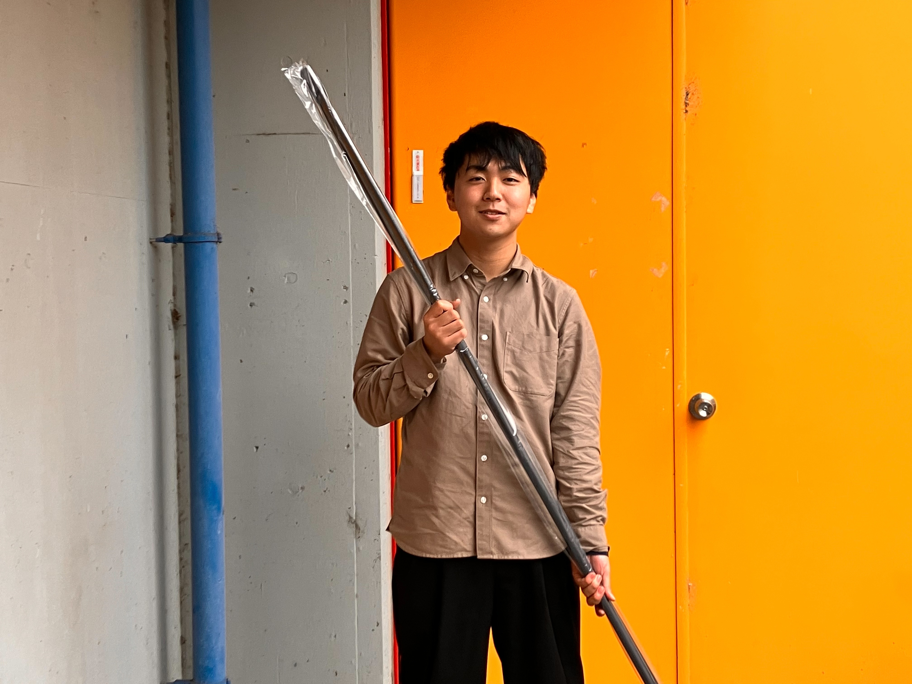

こんにちは，一回生サスペンション担当の藤原です．

先日，株式会社ホーペック様からサスペンションのパーツに使用するカーボンパイプを支援して頂きました．

鉄の代わりにカーボン繊維強化プラスチックを使用することによって、さらなる軽量化を行うことが可能になります

また，サスペンションのみならず，連覇に向けてチーム全員，誠心誠意パーツ製作に取り組んでおります．まだまだ至らない点も多々ございますが，何卒今後とも暖かく見守っていただければ幸いです．

Text:Akito Fujiwara

[株式会社ホーペック様](https://www.hopec.jp/)