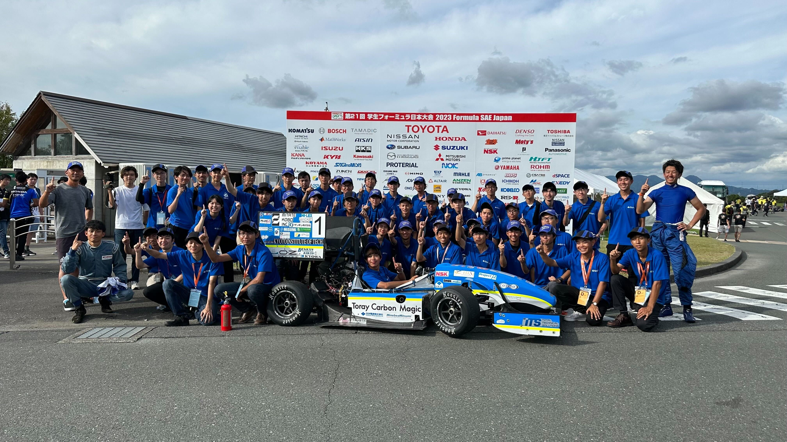

こんにちは，昨年度プロジェクトリーダー，今年度副リーダーの吉田です．

まず，2023年度はブログの更新がほとんどできていなかったことをお詫び申し上げます．

8月28日～9月2日にかけて行われた，学生フォーミュラ日本大会2023において，弊チームは総合優勝をすることができました！これにより昨年度に引き続き2連覇達成となります．これは我々の活動を応援して頂いている学校関係者の方々，スポンサー企業の皆様，そしてメンバーの家族の皆様のお陰です．心より感謝御礼申し上げます．

 私は昨年度幹部として，今年度チームのマネジメント補佐を行って参りました．振り返ると今年度チームもいろいろなトラブルに見舞われながらも乗り越えることができた一年でした．

 昨年度大会優勝チームとして他チームから追われる立場でのスタートとなり，後輩達はプレッシャーに押しつぶされそうになっていました．そんな中でマシンコンセプトを決定，設計を進め，いざ車両製作を行おうとした矢先に，弊チームにお貸し頂いている大学の設備の溶接機が故障し，シェイクダウン(初走行)を予定通り行うことができるのか怪しい状況となりました．しかし，大学の方々のご尽力や弊チームにご協力頂いた企業の方々のお陰で溶接機を早急に復旧でき，メンバーが一丸となり急ピッチで滞っていた製作を進めたため，予定通りの4月16日に2023年度車両のシェイクダウンを行うことができました．

 シェイクダウン以降は試験走行期間となり，車両トラブルは少なく順調に試験走行を行うことができました．一方で，同時に行っていた静的審査の書類作成には昨年度以上に苦戦し，特にコスト書類は昨年度に引き続いて遅延提出となり，昨年度の反省を十分に活かすことができませんでした．しかし，書類作成には昨年度に引き続き弊チームの上級生や社会人OB・OGの先輩方に力を貸して頂き，書類の完成度を高めることができました．結果的に昨年度までとはいかないものの，静的審査全般として好成績を納めることができました．

やはり19年間の歴史あるチームとして，先輩方に助けて頂けることが今のチームの強みであると感じると共に，私自身も今後もチームに貢献していきたいと感じた瞬間でした．

 大会については，車検は昨年度テクニカルリーダーも含めて複数人で車両確認を行ったおかげもあり，ほぼ指摘項目なしで車検通過することができました．その後の騒音テストやブレーキテスト等の動的車検も問題なく通過することができました．

しかし動的審査では，午前中に行われたオートクロスは順調にタイムを残せたものの，次のアクセラレーションの出走前にオイルクーラーからのオイル漏れが発覚し，対応に追われることとなりました．

調査の結果，オイルクーラー本体の疲労破壊であることが判明しましたが，本体の予備を用意しておらず，以降の出走が絶望的な状況となりました．そこに，隣のピットであった京大のチームメンバーの方が奇跡的に弊チームと同じものを貸して下さったため，それを搭載し再度出走できる状態へと修理することができました．パーツを貸して頂いた京大の方々には感謝が絶えません．

その後の走行では，スキッドパッドで1位，オートクロスで１位の成績となりました．

そして大会最終日，最後の動的種目となるエンデュランスでは，オートクロスにて1位を獲得していたため，最終セッションに出走し，この種目でも1位を獲得することができました．しかし，17周目に車体左側に搭載していたラジエーターファンが脱落しておりました．これによるペナルティは課せられず安心しましたが，今回の部品脱落は重く受け止め来年度以降は起こらないよう改善して参ります．

 このようにトラブル続きだった2023年度プロジェクトではありましたが，私達を支えて下さる皆様のお陰で乗り越え，今年度大会でも総合優勝という結果を残すことができました．

 改めて，今年度の弊チームに力をお貸し頂いたすべての皆様に心より感謝申し上げます．

 2023年度大会が終わったため，弊チームでは代替わりを行い2年生主体のチームへと移り変わります．

しかし，私を含めて上級生は引退したわけではありません．我々の最終目標である史上初の4連覇に向かってチーム一丸となって車両開発に邁進する所存です．

今後とも弊チームGrandelfinoを何卒よろしくお願い致します．

 最後に今年度獲得した賞をご紹介し，締めの挨拶とさせて頂きます．

総合優秀賞(1位)

経済産業大臣賞

掛川市長賞

袋井市長賞

日本自動車部品工業会会長賞

ICV総合優秀賞

コスト賞(1位)

スキッドパッド賞(1位)

オートクロス賞(1位)

耐久走行賞(1位)

ベストラップ賞(1位)

Text : Kengo Yoshida