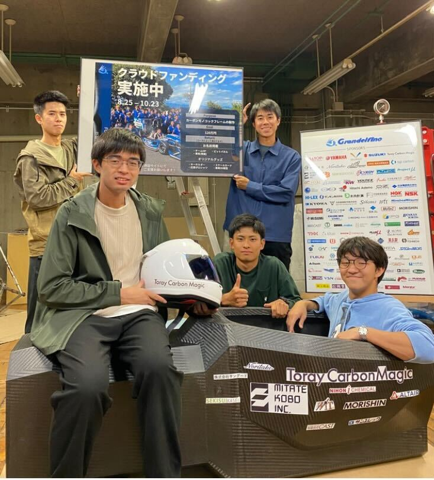

1回生のモノコック担当の玉井です．

先日，2回目の焼きが完了し脱型と受け取りを行いました．受け取ったモノコックフレームの実際の重量が，設計時の重量よりも重くなってしまうなどの問題点は見られましたが，仕上がりは非常に良好で剛性も高まっている印象を受けました．

今回の試験製作によって，大会仕様のG19のフレーム製作に向けて改善策などを立てる事ができました．また10月末には試験走行を行う予定で，それに向けての各パーツの取り付けなど，製作を引き続き行っています．

大会に向けて設計製作を続けて参りますので，今後ともgrandelfinoのご支援ご声援の程よろしくお願いいたします．

Text : Ryuga Tamai

[東レカーボンマジック様](<https://www.carbonmagic.com/>)