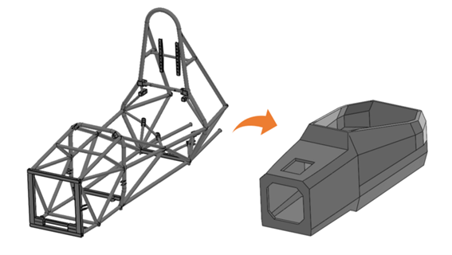

京都工芸繊維大学 B4 森本です．

ご存じの方も多いとは思いますが，弊チームは8/25より60日間，クラウドファンディングを行っておりました．主にカーボンモノコックボディへの移行を目的とし，材料購入や試験走行へのご支援を募ってまいりました．募集期間中の流れは以下の通りです．

ーーーーーーーーーーーーーーーーーーーーー

・8/25：クラウドファンディング開始 

・9/14(開始から21日目)：当初の目標120万円を達成

・9/21(開始から28日目)：ネクストゴール設定

・10/23(開始から60日目)：募集期間終了

ーーーーーーーーーーーーーーーーーーーーー

【結果】97名　1,831,000円

となりました！ご支援いただいた方，本当にありがとうございました！

183万円という額にも驚いておりますが，何より，97名の方々がご支援くださったということが非常に嬉しく，改めて多くの方々に応援していただいているんだということを再確認できた貴重な機会となりました．

皆様から受け取ったお金は，チームを，マシンをより良くするために活用させていただきます．今回ご支援いただいた皆様，日頃より弊チームを応援いただいているスポンサーの皆様など，すべての皆様のご期待に応えられるよう全力で挑戦し続けてまいります．

これからも成長し続けるGrandelfinoを，何卒よろしくお願い致します．

Text : Takehiro Morimoto