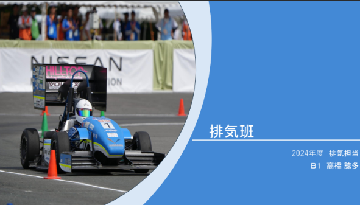

こんにちは．1回生排気担当の高橋諒多です．

10月15日，20日に上回生に向けてパーツプレゼンを行いました．また，OBさんに向けても28日，29日に行いました．私は車に興味があったわけではないので，車に関する知識はゼロに等しく，一から担当パーツである排気について学ぶことになりました．独学で身に着けることは難しく，多くの先輩の力を借りることで，プレゼンするのに必要となる基本知識，そしてGDF-19で排気班として取り組む内容について理解することができました．教えていただいた内容を基にプレゼン資料を作ると，私がどれだけ排気について知識を有しているのかを明確にすることができました．理解の浅い箇所をまた先輩に聞き，さらなる知識が得られることが楽しかったです．

OBさんへのプレゼンに関して一言で感想を述べると，楽しかったです．不安や緊張がなかったわけではありませんが，自分の考えてきた内容を伝え，それをさらにステップアップさせられるような助言が得られることがとても嬉しかったです．やはり学生フォーミュラでは知り得ない情報や，技術など，OBさんの一言一句，すべてが自身の糧になっていくのを感じました．

今後は今回のパーツプレゼンで得られた貴重な意見を反映し，マシンをより良いものにしていこうと思います．設計期に入り，精一杯取り組んでまいりますので，今後ともgrandelfinoのご声援の程よろしくお願いいたします．