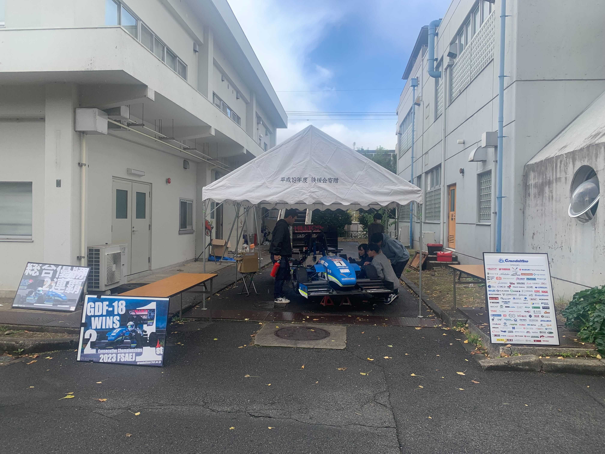

こんにちは．2024年度エアロ担当の田中翔真と申します．

11月24日から26日の３日間，京都工芸繊維大学にて松ヶ崎祭が開催されました．今年度の学祭では，例年実施できていなかった構内走行を1日に2回実施させていただきました．3日間にわたる全6回は全て無事に成功いたしました．つきましては，安全管理に関するご協力ありがとうございました．老若男女問わず多くの方にお越しいただき，間近でGDF-18の音や速さの迫力を感じていただけたことと思います．また，搭乗体験には小さなお子様も搭乗していただけ，将来学生フォーミュラに力を注ぐ姿を想像することができました．

現在は来年度マシンであるGDF-19の設計に尽力しておりますので，引き続きGrandelfinoのご声援の程よろしくお願いいたします．

Text : Shoma Tanaka