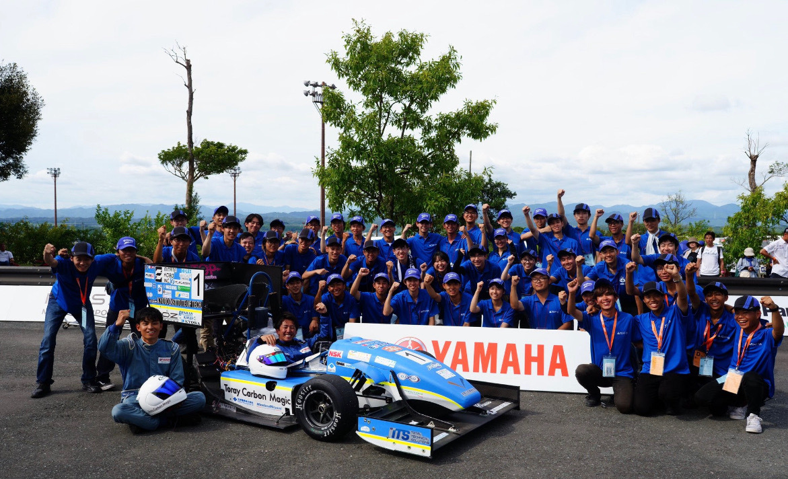

新年あけましておめでとうございます．\
2024年度リーダーの長谷川拓登です． 

2023年度も大学関係者の皆様やスポンサーの皆様が私達の活動を支援してくださり，総合優勝をすることができました．大変お世話になり誠にありがとうございました．\
2連覇をすることができ，目標の4連覇にまた一歩近づくことができました．改めて多大なご支援に御礼申し上げます．

現在は，弊チームの製作期と設計期の間でありますので，パーツの干渉確認や製作練習などに注力しております．\
最後にはなりますが，今年の皆様のご健勝とご発展をお祈り申し上げます．\
今年度も弊チーム一丸となり活動に尽力して参りますので，引き続き”Grandelfino”へのご支援・ご声援の程よろしくお願い申し上げます．